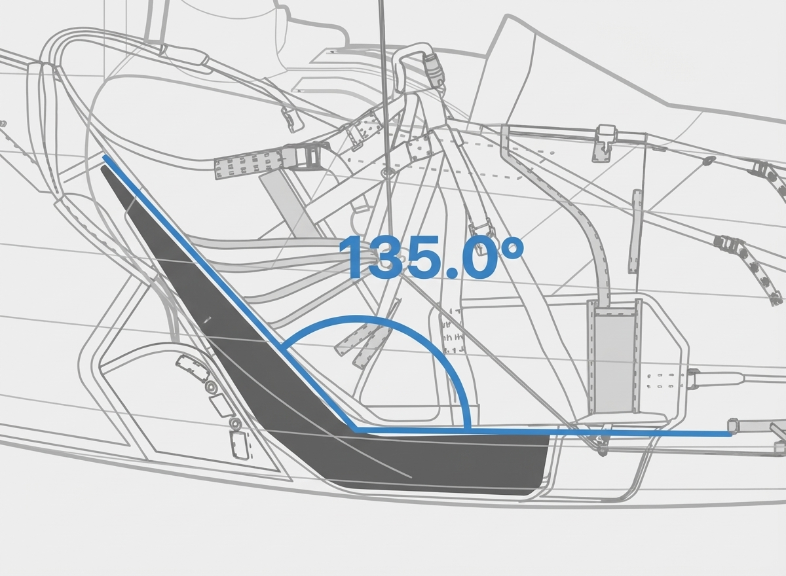

The aim of Open Protector Standard is to address the problems with the EN harness back protector standard.

The problems are two fold:

1. The EN standard is not public - it is a copyrighted standard only accessible behind a paywall.
2. The main problem is that the standard itself has serious safety problems in both the current versions and in the up-and-coming EN draft.

### Standard behind a paywall

Now, the first point is not the manufacturers' fault and is an active debate in the EU right now. Recently, in 2024 the European Court of Justice ruled that certain European safety standards must be free to access (Case C-588/21 P). The logic was simple: if you're legally required to follow a standard, that standard is basically law. And you shouldn't have to pay to read the law.

This ruling specifically applies to "harmonised standards" - standards that are officially linked to EU safety regulations. Our harness back protector standards don't fall into that category, so this ruling doesn't automatically open them up.

But the principle still makes sense for us: we're talking about equipment that protects pilots from spine injuries. Pilots, manufacturers, and safety researchers should all be able to read and evaluate how back protectors are being tested. Hiding safety standards behind a paywall doesn't help anyone.

That said, even if the standard became free tomorrow, it wouldn't fix the real issue. The real issue is that the standard has serious safety flaws which need to be addressed.

**Proposed solution**: make an open-source standard which CIVL / EN WG6 / DHV can use and contribute to.

### Safety problems with the current EN standard

### 1. Lack of weight range

The biggest safety problem by far is that there are no weight ranges defined for protector certification: every protector is tested on a **fixed 50 kg dummy weight**.

This is such a serious issue that I believe there is no point of talking about any measurement until this basic flaw is addressed.

#### The ball experiment

Before I go into more details, let's make an experiment: Drop two balls with the same size and shape from the same drop height onto the same foam mattress. One ball is 1 kg, the other is 10 kg.

- They hit the foam at the same speed
- But the 10 kg ball hits with 10 times more impact energy

What does the foam do with that extra energy?

To absorb more energy, the foam needs to compress more, so the heavier ball will push deeper into the foam.

If we use a simple model where the foam behaves roughly like a spring, then making the ball 10× heavier makes it compress about 3× deeper - - the exact math comes out as sqrt(10) ~ 3.1 times.

So if the 1 kg ball needs about 10 cm of compression to stop, the 10 kg ball might need about 30 cm.

**Thick foam vs thin foam:**

- With a thick mattress (say 50 cm), both balls can be stopped smoothly because there is plenty of thickness available.
- If you keep making the foam thinner, eventually you reach a point where the lighter ball can still be stopped smoothly, but the heavier ball reaches the foam's limit and bottoms out.

**Bottoming out** means the foam reaches the end of its usable compression and stiffens. From this point on, forces and peak deceleration can spike sharply, effectively like hitting the hard layer underneath.

I believe when such bottoming out happens, we can measure extreme acceleration and jerk values - way above any safe limit we are normally even discussing in our standards.

*Note: I'm looking for drop test CSV files of such bottomed out drop tests on foam protectors. If you can, please send me sample files.*

#### Drop tests

Now you can see the core of the problem: if we make a drop test with a 50 kg dummy, we have no information about what happens on the same protector with a 60-70-80 kg dummy.

It might bottom out at 70 kg or it might not. No one knows, possibly not even the manufacturer!

**The only way to know if a protector bottoms out on a 70 kg dummy is to test it with a 70 kg dummy.** No way around it.

At this point I have to note that I'm absolutely puzzled by the fact that in our industry where both paragliders and rescue parachutes have weight ranges by definition, we have allowed the back protector standards to avoid weight ranges for 20+ years. 

**Proposed solution**: introduce weight ranges.

### 2. Under-calculated dummy weight

There is an other problem with the existing test's 50 kg dummy weight: it has been extremely under-calculated.

It is based on the faulty assumption that if we measure the forces acting on the pilot, then we only care about the weight compressing the spine, so the current formula took the average adult torso weight of 50 kg and used it for decades.

But here lies a very serious logical fallacy! The primary criteria for all our measurements is to make sure that the protectors don't bottom out: it doesn't matter what's "sitting" on top of them, it can be a pilot or even a bag of sand! We are measuring how the protector behaves under real-world compression, thus we have to simulate the real-world compression events. 

Which, for a competition pilot flying at 125 kg take off weight cannot be a 50 kg dummy weight!

I believe a better estimate would be 80% of their clip-in weight (meaning take-off-weight excluding the glider). This assumes that the majority of the falls happen leg first, hence the 20% reduction.

Still, in cases where the pilot arrives back-first, this number is close to 100% of their clip-in-weight.

Quick estimation for the leg-first case: 

- a comp pilot is flying a 125 kg glider @ 120 kg
- glider is about 6 kg
- => the pilots clip-in weight is 114 kg

I believe a realistic dummy weight for such pilot would be about:

114 kg * 0.8 => **91 kg**.

It is **almost double **of the currently used **50 kg dummy** weight!

---

I believe there is no point of even discussing measurements, G, jerk, time based values or composite measures like HIC until we are putting pilots on protectors which are overloaded by almost a factor of 2x!

If pilots were getting injured on overloaded rescue parachutes, it'd clearly be a scandal. Yet with protectors we continue like nothing happens and start discussing complex measurements like HIC before even addressing the basic fault in the standard.

---

### 3. Spine area not tested

There are two kind of injuries we need to take into account.

1. Compression fractures
1. Direct hits

The existing standard takes care of the compression fracture direction quite well, using the following dummy configuration.

(Illustration started as the one from Fred's video, I fixed the angles and made it cleaner.)

What's not addressed is direct hits on the spine. Here is a realistic sitting angle as shown in a GIN harness manual, showing that we are reclined about 135 degrees in the new racing harnesses.

(Background illustration copyright: GIN)

