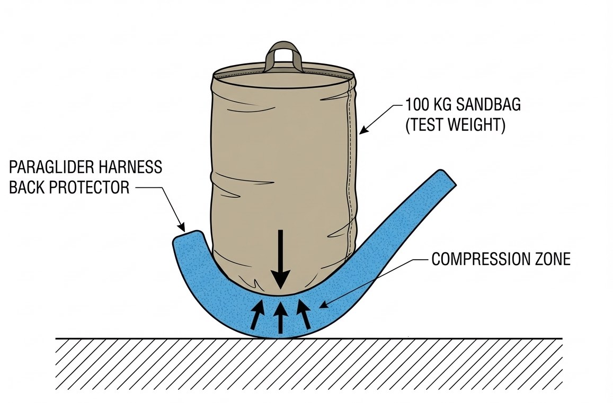
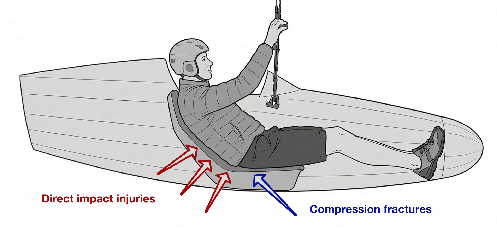
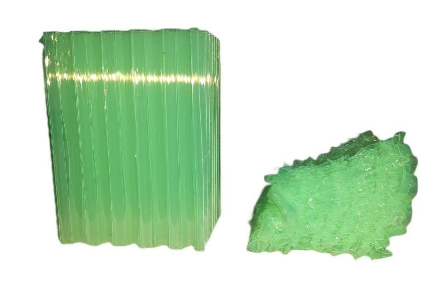
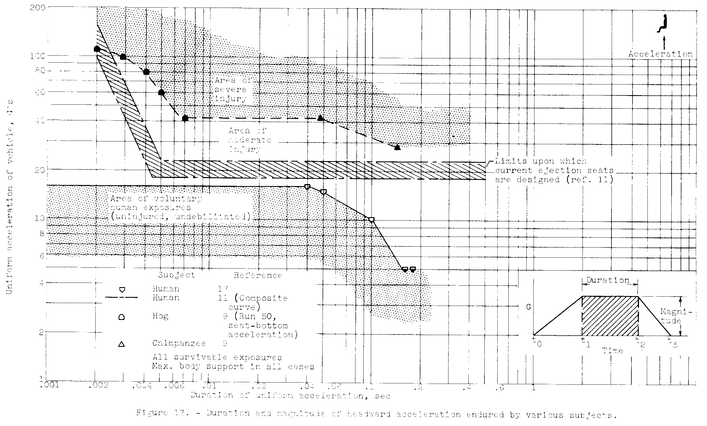
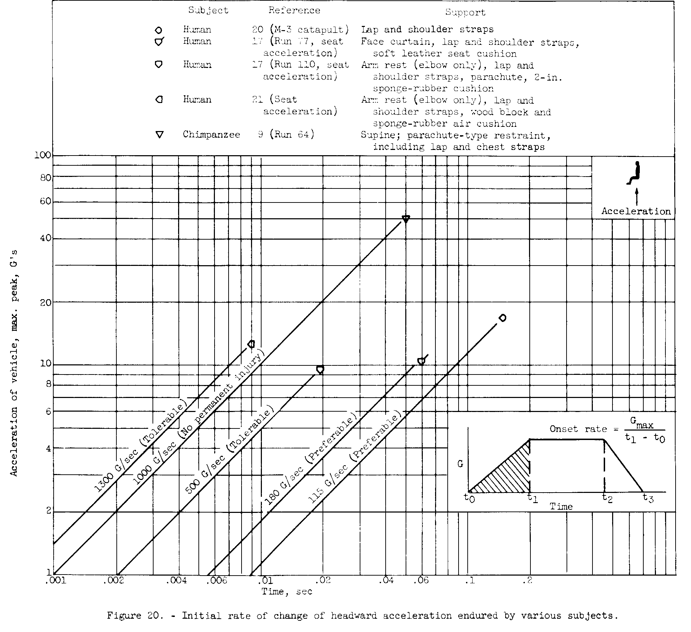
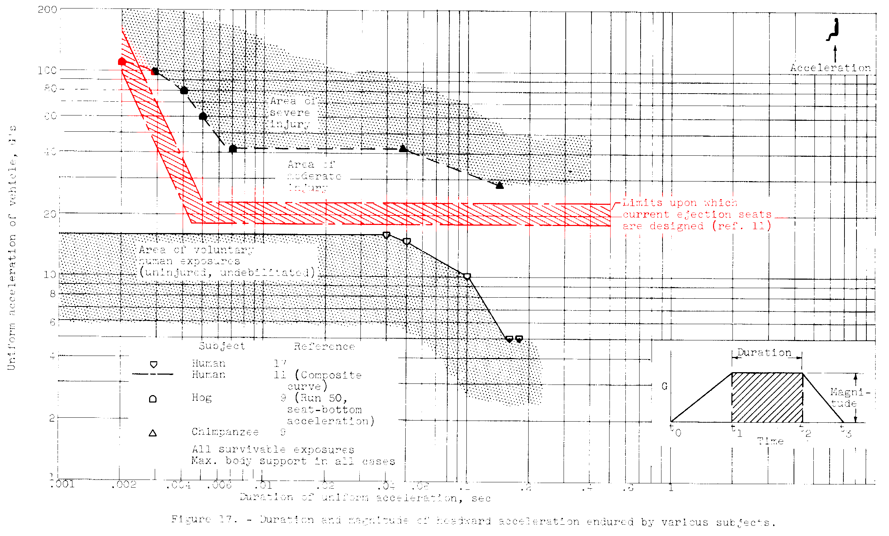
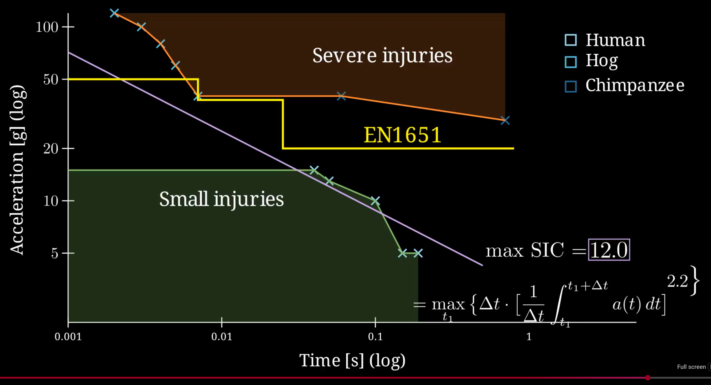
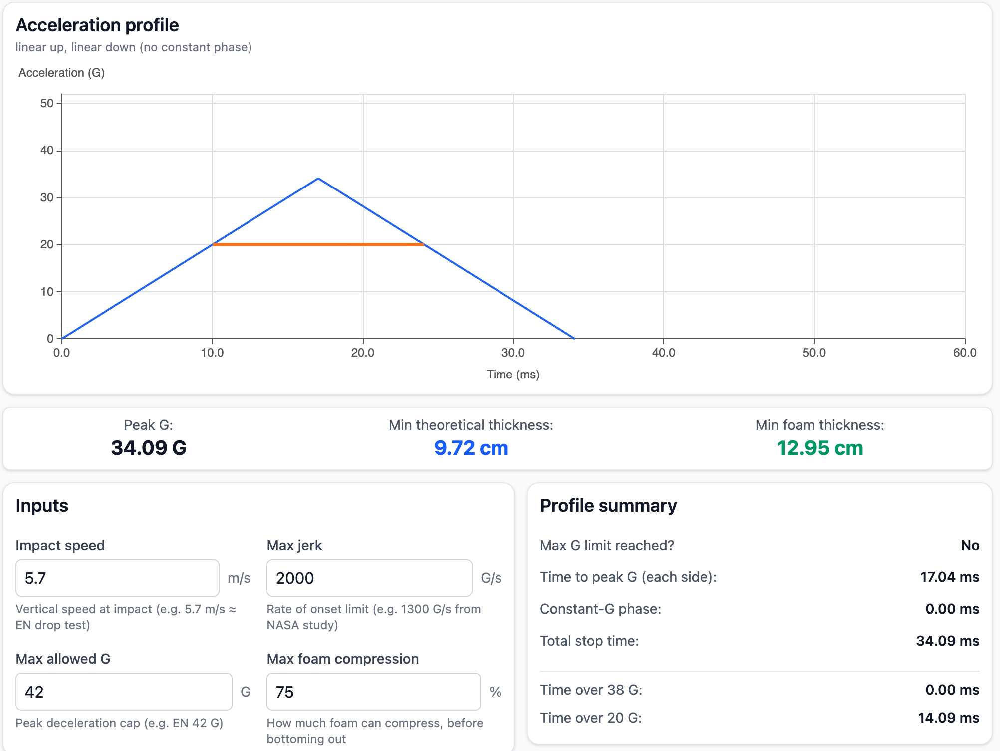
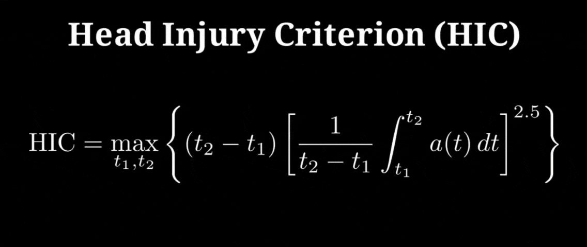

# Problems and Solutions

The aim of the Open Protector Standard is to address the problems with the EN harness back protector standard.

The problems are twofold:

1. The EN standard is not public—it is a copyrighted standard only accessible behind a paywall.
1. The standard itself has serious safety problems in both the current versions and the upcoming EN draft.

## Standard behind a paywall

The first point is not the manufacturers' fault and is currently an active debate in the EU. (This might sound strange to international readers, but both paragliders and harnesses are certified according to an EU standard.)

In 2024, the European Court of Justice ruled that certain European safety standards must be free to access (Case C-588/21 P). The logic was simple: if you're legally required to follow a standard, that standard is effectively law. And you shouldn't have to pay to read the law.

This ruling specifically applies to "harmonised standards"—standards that are officially linked to EU safety regulations. Our harness back protector standards don't fall into that category, so this ruling doesn't automatically open them up.

But the principle still makes sense for us: we're talking about equipment that protects pilots from spinal injuries. Pilots, manufacturers, and safety researchers should all be able to read and evaluate how back protectors are being tested. Hiding safety standards behind a paywall doesn't help anyone.

That said, even if the standard became free tomorrow, it wouldn't fix the real issue: the standard has serious safety flaws that need to be addressed.

**Proposed solution**: Create an open-source standard that CIVL / EN WG6 / DHV can adopt and contribute to.

## Safety problems with the current EN standard

### 1. Lack of weight range

The biggest safety problem by far is that there are no weight ranges defined for protector certification: every protector is tested with a **fixed 50 kg dummy**.

This is such a serious issue that I believe there is no point in talking about any measurement until this basic flaw is addressed.

#### The ball drop experiment

Before I go into more detail, let's imagine an experiment: drop two balls with the same size and shape from the same height onto the same foam mattress. One ball is 1 kg, the other is 10 kg.

- They hit the foam at the same speed $v = \sqrt{2gh}$
- But the 10 kg ball hits with 10× more impact energy $E = mgh$

What does the foam do with that extra energy?

To absorb more energy, the foam needs to compress more, so the heavier ball will push deeper into the foam.

If we use a simple model where the foam behaves roughly like a spring, then the impact energy equals the spring compression energy:

$$E = mgh = \tfrac12 kx^2$$

So the compression depth is:

$$x = \sqrt{\tfrac{2mgh}{k}}$$

That means $x \propto \sqrt{m}$, so the 10× heavier ball compresses it $\sqrt{10} \approx 3.2$ times deeper.

So if the 1 kg ball needs about 10 cm of compression to stop, the 10 kg ball might need about 32 cm.

**Thick foam vs. thin foam:**

- With a thick mattress (say 50 cm), both balls can be stopped smoothly because there is plenty of thickness available.
- If you keep making the foam thinner, eventually you reach a point where the lighter ball can still be stopped smoothly, but the heavier ball reaches the foam's limit and **bottoms out**.

**Bottoming out** means the foam reaches the end of its usable compression and stiffens. From this point on, forces and peak deceleration spike sharply, effectively like hitting a hard layer.

I believe when such bottoming out happens, we can measure extreme acceleration and jerk values - way above any safe limit we normally even discuss in our standards.

*Note: I'm looking for drop test CSV files of such bottomed-out drop tests on foam protectors. If you can, please share sample files.*

#### Drop tests

Now you can see the core of the problem: if we perform a drop test with a 50 kg dummy, we have no information about what happens to the same protector with a 60, 70, or 80 kg dummy.

It might bottom out at 70 kg or it might not. No one knows, possibly not even the manufacturers!

**The only way to know if a protector bottoms out on a 70 kg dummy is to test it with a 70 kg dummy.** No way around it.

At this point, I have to note that I'm absolutely puzzled by the fact that in our industry, where both paragliders and rescue parachutes have weight ranges by definition, we don't have weight ranges for back protectors.

**Proposed solution**: Introduce weight ranges. Test each protector at both ends of the weight range.

### 2. Under-calculated dummy weight

There is another problem with the existing test's 50 kg dummy weight: it is extremely under-calculated.

It is based on the faulty assumption that if we measure the forces acting on the pilot, we only care about the weight compressing the spine. Consequently, the current formula took the average adult torso weight of 50 kg and has used it for decades.

But here lies a very serious logical fallacy! The primary criterion for all our measurements is to ensure that the protectors don't bottom out: it doesn't matter what's compressing them—it can be a pilot + harness + ballast or even a bag of sand! We are measuring how the protector behaves under real-world compression; thus, we have to simulate real-world compression events.

For a competition pilot flying at 125 kg take-off weight, this cannot be a 50 kg dummy!

**Proposed solution:**

**Test with 80% of clip-in weight** (clip-in weight means: take-off weight excluding the glider).

This assumes that the majority of falls happen leg-first, hence the 20% reduction.

Still, in cases where the pilot arrives back-first, this number would be close to 100%.

Quick estimation for the leg-first case:

- a comp pilot is flying a 125 kg glider at 120 kg
- the glider is about 6 kg
- => the pilot's clip-in weight is 114 kg

I believe a realistic dummy weight for such a pilot would be about:

114 kg * 0.8 => **91 kg**.

It is **almost double** the currently used **50 kg dummy** weight!

---

I believe there is no point in even discussing measurements, G-force, jerk, time-based values, or composite measures like HIC until we put pilots on protectors that are overloaded by almost a factor of 2!

If pilots were getting injured on overloaded rescue parachutes, it would be a scandal. Yet with protectors, we continue as if nothing is happening and start discussing complex measurements like HIC before even addressing the basic fault in the standard.

---

### 3. Spine area not protected

There are two kinds of injuries we need to take into account:

1. **Compression fractures**
2. **Direct impact injuries**

The existing standard addresses the compression fracture direction quite well using the following dummy configuration.

*(Illustration based on the one from Fred's video; I fixed the angle and made it cleaner.)*

What's not addressed are **direct impact injuries**.

Direct impact injuries are extremely common during failed takeoffs and landings with stalled gliders. Previous generation racing harnesses covered this area quite well, and many non-competition XC harnesses cover it today. The problem is that some aerodynamically optimised harnesses lack this protection altogether.

**Proposed solution: Add 2 more testing points along the spine**, in addition to the sitting position test point currently used.

Proposed new testing points:

- **thoracolumbar junction (T11 – L2 region)**
- **lumbosacral junction (L5 – S1 region)**

Both are critical points for direct impact injuries.

Anatomy illustration from Wikipedia:

### 4. Missing jerk limit

The NASA studies frequently referred to in back protector discussions focus on 3 kinematic variables:

- acceleration (e.g. 42 G)
- jerk (e.g. 1300 G/s)
- time-based measurements (e.g. 25 ms over 20 G)

The current EN standard incorporates limits on acceleration and time-based measurements, while missing the jerk limit test.

This is especially relevant: problematic protectors, like Koroyd, have multiple times the safe jerk limit of what NASA suggests.

Meanwhile, previous-generation foam protectors are within the safe limits.

**Proposed solution:** add a **jerk limit criterion** to the test.

I'm not proposing to adopt the NASA limit. I'm proposing to re-measure this value on previous-generation known-safe harnesses (Exoceat, Kanibal 2) at a realistic dummy weight for an average comp pilot (e.g. 75 kg).

### 5. Single-use protectors in competitions

Another big problem with protectors like Koroyd is that they are single-use materials: if they are involved in a crash, they'll crumple and have to be replaced.

(Source: DHV)

This might not be a problem for a hobbyist pilot making an XC flight, as they can just wait with their next flight until they buy a new protector.

Meanwhile, for cross-country competitions it is not acceptable: if someone uses their protector on the 1st day of a Cat1, they should not be risking their life flying with a crumpled protector during the next 9 tasks.

**Proposed solution:** introduce two classes of protectors:

- single-use (-S)
- multi-use (-M)

The tests are identical, except that for multi-use protectors, the process starts with a stress test: making 5 unmeasured drops at the upper weight limit. The real, measured drop tests start afterward.

Who decides which class to use: the manufacturers submit their product in the class they choose.

The decision between -S and -M would be enforced at the competition level; for example, cross-country Cat1 events could require multi-use (-M) protectors.

Meanwhile, H&F events with supporters might allow single-use (-S) protectors as well, as a supporter in the car can carry a spare protector.

## Problems with the upcoming EN draft

*Note: As EN draft is not public and is still a work-in-progress, I'm referring to Fred Pieri's work as "EN draft". Fred's work can be seen in his great [video](https://www.youtube.com/watch?v=EnRK16sgj8A) and [article](https://fredvol.bitbucket.io/Misc/jerk_analysis/p2/report_jerk_p2.html).*

I believe the main problem with the EN draft is two-fold:

- it focuses only on time-based duration criteria
- meanwhile avoiding the jerk (onset) criteria

These two graphs are next to each other in the NASA 1959 Eiband study:

Page 78 shows the duration graph:

Page 81 shows the onset = jerk graph:

Looking at the duration graph, we can see that there is a middle section called "Limits upon which current ejection seats are designed".

This area clearly has to be tolerable: this is exactly what NASA arrived for as a design for their future ejector seats.

From the red graph, we can see that:

- ~24 G is tolerable until 0.5 sec = 500 ms. This is way above anything we can possibly get in our 1.6 meter drop tests. 
- The NASA injury limit for 50 ms is ~42 G. We'll see it's simply impossible to reach this with the proposed jerk limits.

Meanwhile the current EN test limits is already 20x (!) stricter compared to the NASA value: only 25 ms allowed above 20 G. In the new draft it looks like an even lower value at around 15 ms (the white diagonal line):

Why is it a problem to propose stricter duration limits compared to NASA ejection seat recommendations? 

Because we'll see that duration values are inversely correlated to jerk values, and requiring low duration values would actually hurt jerk behaviour.

At this point we've arrived at what I believe is the biggest question in back protectors:

**Are time based limits actually reflecting pilot injuries?**

I believe based on the pilot reports I collected for the article: [Protector Incident Research: Koroyd vs Airbag](https://hyperpilot.substack.com/p/protector-incident-research-koroyd), that the answer is **no**.

Take this example from Fred's video.

- The blue protector could be a below-average foam protector @ 40 G (Exoceat and Kanibal is better at 36-37 G).
- The orange protector could be a high quality inflatable airbag @ 31 G.

The blue graph shows higher G and higher jerk (steeper sides) while the orange shows lower G and lower jerk (less steep sides).

Fred reasons that the blue is the safer protector and this is reflected in the SIC value he is proposing: the blue protector gets the lower SIC value (10) vs the orange one (11).

This is exactly the opposite of what I've found in my research: I'd clearly choose the orange protector for my own protection today.

**Why?**

Because real-world pilot injury reports show that the best protectors available today are **low G, low jerk full-sized airbags**, exactly like the orange protector.

Moreover, if we look a bit on these graphs, we can see that jerk and time-based limits are inversely correlated: the steeper the curve => the shorter the "time above 20 G" horizontal line is.

This is confirmed by the existing EN test reports and their estimated jerk values:

- Gin GR5: **17.5 ms** | jerk ~**5369 G/sec**

- Submarine: **18.3 ms** | jerk ~**8000 G/sec**

- Exoceat: **19.5 ms** | jerk ~ **1245 G/sec**
- Kanibal: **19.6 ms** | jerk ~**1216 G/sec**
- Skywalk RXA3: **22.5 ms** | jerk ~**1186 G/sec**

We can see that **protectors with the lowest jerk values have the highest durations values** and the **protectors with the lowest duration values are all Koroyd**.

I believe that by requiring these overly strict duration requirements, and not taking into account the jerk limits, we are actually killing the best protectors in the market.

**Proposed solution**

I believe duration limits are actually not needed when we have jerk limits. 

Why? Have a look at the visualizer app on [harnessvis.hyperknot.com](https://harnessvis.hyperknot.com/)

Even at 2000 G/sec average jerk, we can only reach 34 G so the 42 G limit is not relevant. And even if we count the "Time over 20 G" duration 2x because of a bounce, we are only at 2 * 14 = 28 ms, well below the NASA ejector seat's limit of 500 ms.

#### A comment on "SIC"

As for "SIC", I cannot wrap my head around the fact that the proposal takes something called "Head Injury Criterion", changes the exponent from 2.5 -> 2 and renames it to "Spine Injury Criterion".

This is wrong on many levels. Science doesn't work like this. We cannot just invent medical "criterions" by changing names and exponents without doing medical studies.

I understand the idea behind it: it is to replace the step function (yellow line) with a single line (white line). We adjust the exponent to get the line angle correct. [Fred's video](https://www.youtube.com/watch?v=EnRK16sgj8A) does a brilliant job of explaining it.

But please don't call it "Spine Injury Criterion", call it "Time-Integrated Acceleration Criteria" as it's written a few seconds before. I believe it's worth discussing, it's an interesting idea, it's just the name which I disagree with.

### 

